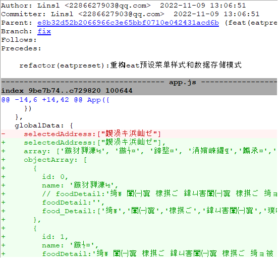
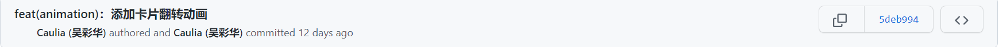
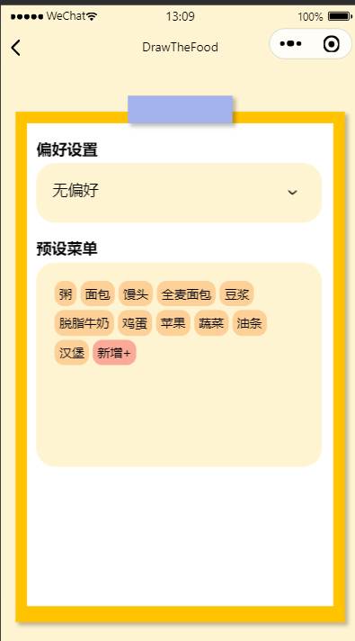
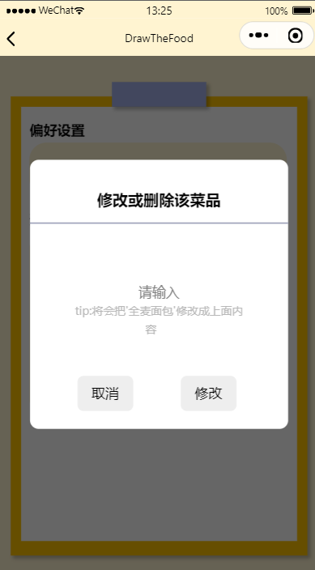
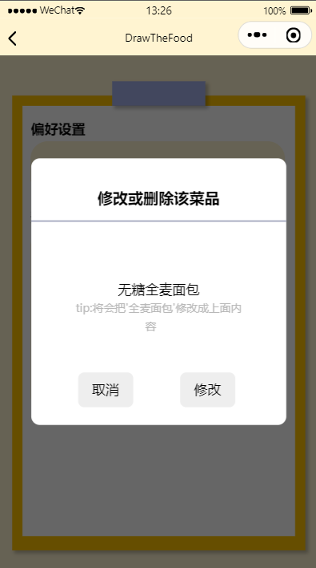
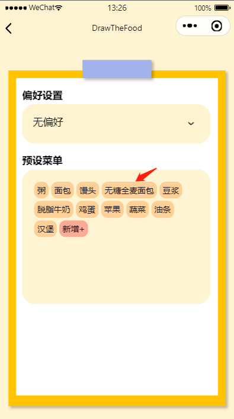

| 作业所属课程 | [软件工程](https://bbs.csdn.net/forums/gdut-ryuezh?typeId=33729) |
| :----------- | :----------------------------------------------------------- |
| 作业要求     | [团队作业4——项目冲刺](https://bbs.csdn.net/topics/608948198) |
| 作业目标     | 成员昨日工作完成情况及困难、每日感想<br />项目燃尽图、代码签入、项目截图 |

[toc]
# 一、 站立式会议记录

## 1.1 开展形式

> 形式：每日固定时间在微信群聊上进行定点汇报。
>
> 记录：
>
> 
>
> 记录者：方琼

## 1.2 昨日进展

| 角色 | 进展                                             |
| ---- | ------------------------------------------------ |
| 开发 | 修复全选功能、新增抽卡动画、"吃啥"中的菜单新样式 |
| 测试 | 检查开发具体实现情况3：PC实测                    |

## 1.3 存在问题

### 1.3.1 测试

1 手机端小程序各功能正常运行；

2 电脑端吃啥模块预设初始化录入数据正常，但无法修改，联系开发解决；

3 解决后重新检查电脑端和手机端：手机端和电脑端各功能都正常运行；

4 两功能交叉检查，问题：开发代码不严谨，没有设切换功能时重置本功能。

### 1.3.2 开发

| 人物   | 所遇困难             | 问题描述           |
| ------ | -------------------- | ------------------ |
| 林仕龙 | "吃啥"中的菜单新样式 | 页面直接数据不互通 |

## 1.4 今日计划

| 角色 | 人物     | 计划                                                         |
| ---- | -------- | ------------------------------------------------------------ |
| 开发 | 林仕龙   | "吃啥"中的数据存储方式重构<br />增加修改预设菜品中指定菜品的功能 |
|      | 吴彩华   | 完成最后收尾工作、修复之前发现的bug                          |
| 测试 | 欧阳琳瑜 | 进行收尾测试、整体检查                                       |


# 二、项目燃尽图

> 链接：https://www.kdocs.cn/l/cbpnjTPRQajf

# 三、代码/文档签入记录

## 3.1 代码签入截图

/2-7/img/10.png)





# 四、项目程序/模块最新（运行截图）

## 4.1 代码展示

### 4.1.1 "吃啥"中的菜单新样式

```html
    <scroll-view scroll-y>
        <view class="food_item" wx:for="{{objectArray[index].food_Detail}}" bindtap="showPopup" data-name="{{item}}">{{item}}</view>
            <popup id='popup'
              title="修改或删除该菜品"
              bind:close="_close"
            ></popup>
            <view class="food_item add_until">新增+</view>
            <!-- <view bindtap="xxxsss">按钮</view> -->
          </scroll-view>

<view class="wx-popup" style="margin:-{{windowHeight/2}}px 0 0 -{{windowWidth/2}}px" hidden="{{flag}}">
  <view class='popup-container'>
    <view class="wx-popup-title">{{title}}</view>
    <!-- <view class="wx-popup-con" >{{content}}</view> -->
    <view class="wx-popup-con" >
      <input type="text" auto-focus placeholder="请输入" bindblur="select_text_change"/>
      <text style="color: rgb(184, 184, 184);font-size: small;">tip:将会把'{{select_food}}'修改成上面内容</text>
    </view>
    <view class="wx-popup-btn">
      <view bindtap="_close" class="popup_btn">取消</view>
      <view bindtap="_change" class="popup_btn">修改</view>
    </view>
  </view>
</view>
```

### 4.1.2 重构存储方式

```js
globalData: {
    selectedAddress:["四饭二楼"],
    array: ['无偏好', '早餐', '午餐', '下午茶','晚餐','夜宵'],
    objectArray: [
      {
        id: 0,
        name: '无偏好',
        // foodDetail:'粥 面包 馒头 全麦面包 馒头 粥类 杂粮 豆浆 脱脂牛奶 鸡蛋 苹果 蔬菜 油条 汉堡 蛋糕 饼干 薯条 火腿 方便面 北京烤鸭 泰餐 寿司 烧鸡 盖浇饭 砂锅 大排档 米线 满汉全席 西餐 麻辣烫 关东煮 自助餐 炒面 快餐 水果 西北风 馄饨 火锅 烧烤 泡面 速冻水饺'
        foodDetail:'',
        food_Detail:['粥','面包','馒头','全麦面包','豆浆','脱脂牛奶','鸡蛋','苹果','蔬菜','油条','汉堡']
      },
      {
        id: 1,
        name: '早餐',
        foodDetail:'粥 面包 馒头 全麦面包 馒头 粥类 杂粮 豆浆 脱脂牛奶 鸡蛋 苹果 蔬菜 油条 汉堡 蛋糕 饼干 薯条 火腿 方便面'
      },
      {
        id: 2,
        name: '午餐',
        foodDetail:'北京烤鸭 泰餐 寿司 烧鸡 盖浇饭 砂锅 大排档 米线 满汉全席 西餐 麻辣烫 关东煮 自助餐 炒面 快餐 水果 西北风 馄饨'
      },
      {
        id: 3,
        name: '下午茶',
        foodDetail:'喜茶 星巴克 C22 一点点 益禾堂 CoCo都可 茶理宜世 蜜雪冰城 奈雪の茶 古茗 书亦烧仙草 手挞柠檬茶 桃园三章'
      },
      {
        id: 4,
        name: '晚餐',
        foodDetail:'火锅 烧烤 泡面 速冻水饺 日本料理 涮羊肉 拉面 肯德基 面包 扬州炒饭 酸菜鱼 茶餐厅 海底捞 咖啡 比萨 麦当劳 兰州拉面 沙县小吃 烤鱼 海鲜 铁板烧 韩国料理 粥 快餐 东南亚菜 甜点 农家菜 川菜 粤菜 湘菜 竹笋烤肉'
      },
      {
        id: 5,
        name: '夜宵',
        foodDetail:'沙县小吃 烤鱼 海鲜 铁板烧 韩国料理 粥 快餐 东南亚菜 甜点 农家菜 川菜 粤菜 湘菜 竹笋烤肉'
      }
    ],
    index: 0
  }
```

### 4.1.3 修改指定菜品

```js
    _change(){
      let select_food = this.data.select_food;
      let select_text = this.data.select_text;
      let index = app.globalData.index;
      let objectArray = app.globalData.objectArray;
      let food_Detail = objectArray[index].food_Detail;
      for (let i = 0; i <food_Detail.length; i++){
        if(food_Detail[i]==select_food){
          food_Detail[i]=select_text;
        }
      }
      app.globalData.objectArray[index].food_Detail=food_Detail;
      this.triggerEvent("close");
    },

    select_text_change(e){
      this.setData({
        select_text:e.detail.value
      })
    }
 bindPickerChange: function (e) {
    app.globalData.index=e.detail.value;
    let index=app.globalData.index;
    let objectArray=app.globalData.objectArray;
    wx.setStorageSync('foods', objectArray[index]);
    this.dataRefresh();
  },

  userblur:function(e) {
    let index=app.globalData.index;
    let objectArray=app.globalData.objectArray;
    objectArray[index].foodDetail=e.detail.value;
    app.globalData.objectArray=objectArray;
    wx.setStorageSync('foods', objectArray[index]);
    this.dataRefresh();
  },

  onLoad(options) {
    this.dataRefresh();
  },

  // 更新本页面data
  dataRefresh(){
    this.setData({
      array:app.globalData.array,
      objectArray:app.globalData.objectArray,
      index:app.globalData.index
    })
  },
  
  showPopup(e){
    this.popup.showPopup(e);
  },

  onReady() {
    this.popup = this.selectComponent("#popup");
  },

  _close() {
    console.log("你点击了关闭按钮");
    this.dataRefresh();
    this.popup.hidePopup();
  },
```

### 4.1.4 修复全选功能

```js
setAllSelect:function(){
    // 若点击之前为true
    let preAddress = this.data.addressArray
    const status = this.data.allSelect

    if(this.data.allSelect){
      preAddress.map(item => {
        item.checked = false
        return item
      })
    } else {
      preAddress.map(item => {
        item.checked = true
        return item
      })
    }
    app.globalData.selectedAddress = status? []:this.returnSelectedArray(this.data.addressArray)
    this.setData({addressArray:preAddress,allSelect:!status})
  },

  observeAll(e) {
    // 监控是否全选
    if(app.globalData.selectedAddress.length === this.data.addressArray.length){
      this.setData({allSelect:true})
    } else {
      this.setData({allSelect:false})
    }
  },
```


### 4.1.5 抽卡动画

```js
  getAnimation() {
    this.animationBack.rotateY(90).step({
      duration:600
    })
    this.setData({animationBack: this.animationBack.export()})

    this.animationFace.rotateY(0).step({
      duration:600,
      delay:400
    })
    this.setData({
      animationFace: this.animationFace.export(),
      isChange:true
    })
  },

  changeAnimation() {
    this.animationFace.rotateY(-90).step({
      duration:600,
    })
    this.setData({
      animationFace: this.animationFace.export(),
    })

    this.animationBack.rotateY(0).step({
      duration:600,
      delay:400
    })
    this.setData({animationBack: this.animationBack.export()})


    this.animationBack.rotateY(180).step({
      duration:600,
      delay:1000
    })
    this.setData({animationBack: this.animationBack.export()})

    this.animationFace.rotateY(90).step({
      duration:600,
      delay:1000
    })
    this.setData({
      animationFace: this.animationFace.export(),
      isChange:true
    })
  },
```


## 4.2 运行截图

### 4.2.1 菜单新样式



### 4.2.2 修改操作







动画放在测试版本~

# 五、每日每人总结

| 人物     | 总结                                                         |
| -------- | ------------------------------------------------------------ |
| 林仕龙   | 数据的交互存在缺陷，可能需要重构数据存储的模式。<br />因为重构存储方式，所以轮播图那边要做好接口对接数据。还有删除功能未完成。 |
| 吴彩华   | 功能已完全实现                                               |
| 欧阳琳瑜 | 稍微有点上道了，但测试时写了几个无用的脚本，浪费了好多时间，两位开发之间交流不密切，功能合并时出问题，这是很容易发生的情况，要着重测试 |

