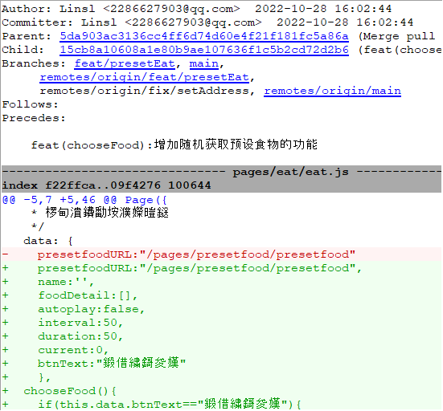
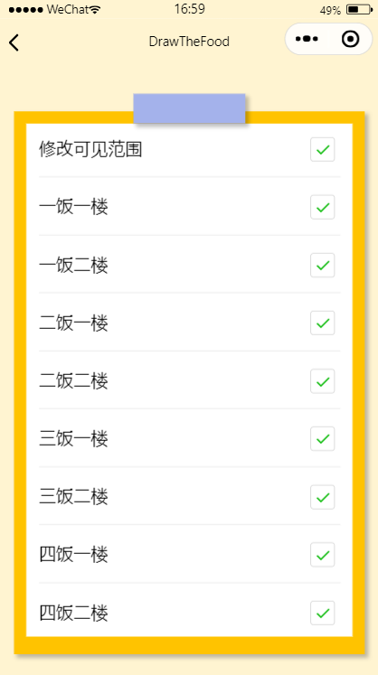

| 作业所属课程 | [软件工程](https://bbs.csdn.net/forums/gdut-ryuezh?typeId=33729) |
| :----------- | :----------------------------------------------------------- |
| 作业要求     | [团队作业4——项目冲刺](https://bbs.csdn.net/topics/608948198) |
| 作业目标     | 成员昨日工作完成情况及困难、每日感想<br />项目燃尽图、代码签入、项目截图 |


[toc]
# 一、 站立式会议记录

## 1.1 开展形式

> 形式：每日固定时间在微信群聊上进行定点汇报。
>
> 记录：
>
> 
>
> 记录者：方琼

## 1.2 昨日进展

| 角色 | 进展                                   |
| ---- | -------------------------------------- |
| 开发 | 修改预设全选逻辑、"吃啥"中命运抉择功能 |
| 测试 | 检查UI                                 |

## 1.3 存在问题

### 1.3.1 测试

|                      | 问题                 | 反馈                                     | 备注                                                         |
| -------------------- | -------------------- | ---------------------------------------- | ------------------------------------------------------------ |
| 检查改进后的原型     | 是否增加提示         | 已增加，在原型增加了，实际开发还没加上。 | 相比于完成主要功能，增加提示优先度较低，等完成主体后再修改   |
|                      | 是否增加反馈途径     | 否                                       | 小程序有官方反馈的渠道，用户只需要在右上角更多处点击进行反馈即可。 |
| 测试开发已完成的功能 | 吃啥部分轮播图有问题 | 前端已在修改                             | 修改完预设回来还没点击就自动滚动，当提供的随机项过少时，随机结束后，选中的选项不能停住在界面中，上下晃动不停 |

### 1.3.2 开发

| 人物   | 所遇困难              | 问题描述                    |
| ------ | --------------------- | --------------------------- |
| 林仕龙 | "吃啥"中命运抉择功能  | 失控bug确定是小程序组件原因 |
| 吴彩华 | 初始化项目、构建tab栏 | 没有困难                    |

## 1.4 今日计划

| 角色 | 人物     | 计划                     |
| ---- | -------- | ------------------------ |
| 开发 | 吴彩华   | 修改预设全选逻辑         |
|      | 林仕龙   | "吃啥"中命运抉择功能修复 |
| 测试 | 欧阳琳瑜 | 测试吃点啥模块2          |


# 二、项目燃尽图

> 链接：[DrawTheFood项目进度表 (kdocs.cn)](https://www.kdocs.cn/l/cbpnjTPRQajf)

# 三、代码/文档签入记录

## 3.1 代码签入截图



# 四、项目程序/模块最新（运行截图）

## 4.1 代码展示

### 4.1.1 修改预设全选逻辑

```js
//Arthur:吴彩华
setAllSelect:function(){
    // 若点击之前为true
    let preAddress = this.data.addressArray
    const status = this.data.allSelect

    if(this.data.allSelect){
      preAddress.map(item => {
        item.checked = false
        return item
      })
    } else {
      preAddress.map(item => {
        item.checked = true
        return item
      })
    }
    app.globalData.selectedAddress = status? []:this.returnSelectedArray(this.data.addressArray)
    this.setData({addressArray:preAddress,allSelect:!status})
  },

  observeAll(e) {
    // 监控是否全选
    if(app.globalData.selectedAddress.length === this.data.addressArray.length){
      this.setData({allSelect:true})
    } else {
      this.setData({allSelect:false})
    }
  },

```

### 4.1.2 bug修复

```js
//Arthur:林仕龙
chooseFood(){
    if(this.data.btnText=="命运抉择"){
      this.setData({
        btnText:"随机",
        autoplay:true,
        interval:90,
        duration:90,
      })
    }else{
      this.setData({
        btnText:"随机",
        autoplay:true,
        interval:90,
        duration:90,
      })
      clearInterval(this.data.myInterval)
      this.setData({
        cont:0,
        myInterval:setInterval(()=>{
          this.setData({
            cont:this.data.cont+1
          })
          if(this.data.cont<10){
            this.setData({
              autoplay:false,
            })
            this.setData({
              autoplay:true,
              interval:this.data.interval+20,
              duration:this.data.duration+20
            })
          }else{
            this.setData({
              autoplay:false,
              btnText:"命运抉择"
            })
            clearInterval(this.data.myInterval);
          }
        },300)
      })
    }
  },
```


## 4.2 运行截图

### 4.2.1 全选



### 4.2.1 修复展示

修复后的交互逻辑：点击“命运抉择”按钮，菜名部分开始快速滚动，用户可以点击“暂停”获取随机出来的菜名。


# 五、每日每人总结

| 人物     | 总结                                               |
| -------- | -------------------------------------------------- |
| 吴彩华   | 小程序的组件和文档提供的信息较少，需要自己构建组件 |
| 林仕龙   | 将轮播图组件的速率调慢就能修复bug                  |
| 欧阳琳瑜 | 吃点啥模块还未完成，应该晚点再测                   |