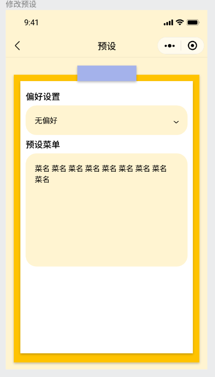
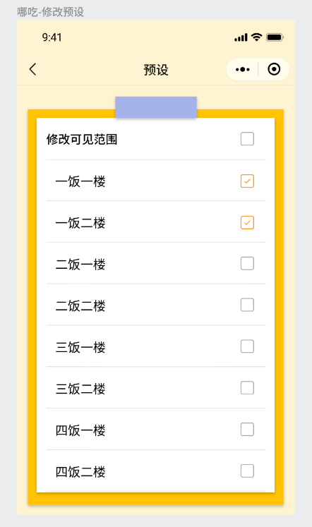
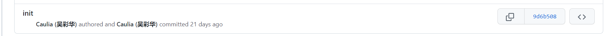
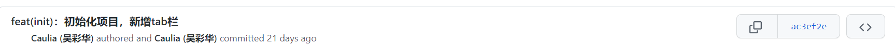
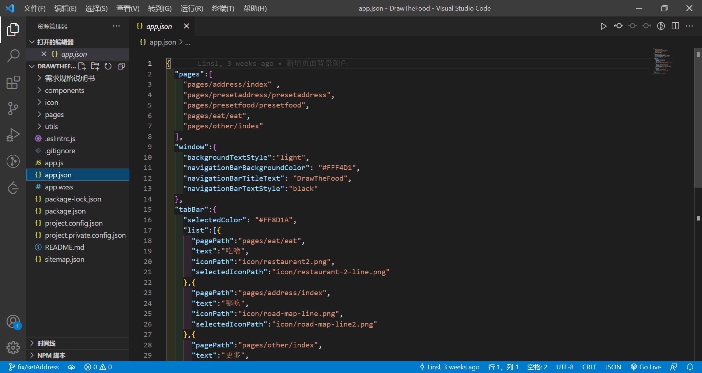
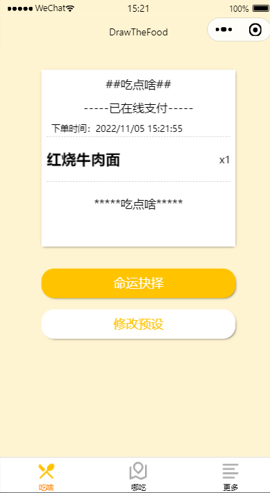

| 作业所属课程 | [软件工程](https://bbs.csdn.net/forums/gdut-ryuezh?typeId=33729) |
| :----------- | :----------------------------------------------------------- |
| 作业要求     | [团队作业4——项目冲刺](https://bbs.csdn.net/topics/608948198) |
| 作业目标     | 成员昨日工作完成情况及困难、每日感想<br />项目燃尽图、代码签入、项目截图 |

# 一、 站立式会议记录

## 1.1 开展形式

> 形式：每日固定时间在微信群聊上进行定点汇报。
>
> 记录：
>
> 
>
> 记录者：方琼

## 1.2 昨日进展

| 角色 | 进展                                                     |
| ---- | -------------------------------------------------------- |
| 开发 | 明晰需求和原型UI、初始化项目、框架搭建、底部Tab栏搭建    |
| 测试 | 框架，UI检查验收，检查原型，包括界面美观、操作难易程度等 |


## 1.3 存在问题

### 1.3.1 测试

**吃啥模块**

> 
>
> **问题**：交互较少提示，对新用户不友好
>
> 1 没有提示菜名输入格式
>
> 2 没有提示修改后直接返回保存
>
> **建议**：直接提示或者添加提示字段，点开是相关提示

**哪吃模块**

> 
>
> 问题：缺少添加用户自定义选项

### 1.3.2 开发

| 人物   | 所遇困难                   | 问题描述                                                     |
| ------ | -------------------------- | ------------------------------------------------------------ |
| 林仕龙 | 框架搭建                   | 小程序自带的轮播图在播放速度太快时会失控，初步判断为微信开发平台自带组件有问题。 |
| 吴彩华 | 对小程序的项目架构不太了解 | 之前学的是react框架，与小程序类似的VUE框架了解较少           |


## 1.4 今日计划

> 开发：
>
> | 人物   | 事项                 |
> | ------ | -------------------- |
> | 林仕龙 | "吃啥"中命运抉择功能 |
> | 吴彩华 | 修改预设全选逻辑     |
>
> 测试（欧阳琳瑜）： 检查昨日改进后的原型， 测试开发已完成的功能


# 二、项目燃尽图

> 链接：[DrawTheFood项目进度表 (kdocs.cn)](https://www.kdocs.cn/l/cbpnjTPRQajf)

# 三、代码/文档签入记录

## 3.1 代码签入截图






# 四、项目展示

## 4.1 代码展示

```js
//框架搭建--@Authur林仕龙
chooseFood(){
    if(this.data.btnText=="命运抉择"){
      this.setData({
        btnText:"随机",
        autoplay:true,
        interval:90,
        duration:90,
      })
    }else{
      this.setData({
        btnText:"随机",
        autoplay:true,
        interval:90,
        duration:90,
      })
      clearInterval(this.data.myInterval)
      this.setData({
        cont:0,
        myInterval:setInterval(()=>{
          this.setData({
            cont:this.data.cont+1
          })
          if(this.data.cont<10){
            this.setData({
              autoplay:false,
            })
            this.setData({
              autoplay:true,
              interval:this.data.interval+20,
              duration:this.data.duration+20
            })
          }else{
            this.setData({
              autoplay:false,
              btnText:"命运抉择"
            })
            clearInterval(this.data.myInterval);
          }
        },300)
      })
    }
  },
```

@Arthur-吴彩华

初始化页面：



Tab栏搭建：

```js
"tabBar":{
    "selectedColor": "#FF8D1A",
    "list":[{
      "pagePath":"pages/eat/eat",  
      "text":"吃啥",
      "iconPath":"icon/restaurant2.png",
      "selectedIconPath":"icon/restaurant-2-line.png"
    },{
      "pagePath":"pages/address/index", 
      "text":"哪吃",
      "iconPath":"icon/road-map-line.png",
      "selectedIconPath":"icon/road-map-line2.png"
    },{
      "pagePath":"pages/other/index", 
      "text":"更多",
      "iconPath":"icon/other.png",
      "selectedIconPath":"icon/other2.png"
    }]
  },
```


## 4.2 运行截图

初始化项目


整体框架



# 五、每日每人总结

| 人物     | 总结                                                         |
| -------- | ------------------------------------------------------------ |
| 方琼     | 顺利完成第二天工作！Homie们棒棒棒！                          |
| 林仕龙   | 数据交互需要更进                                             |
| 吴彩华   | 今天一步步初始化小程序，对小程序项目的构造进行了大致的了解。 |
| 欧阳琳瑜 | UI设计很棒，只有小细节的问题，我顶礼膜拜。                   |

