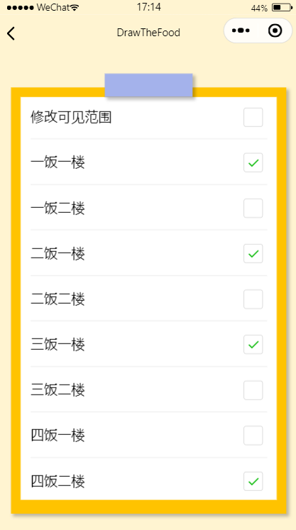
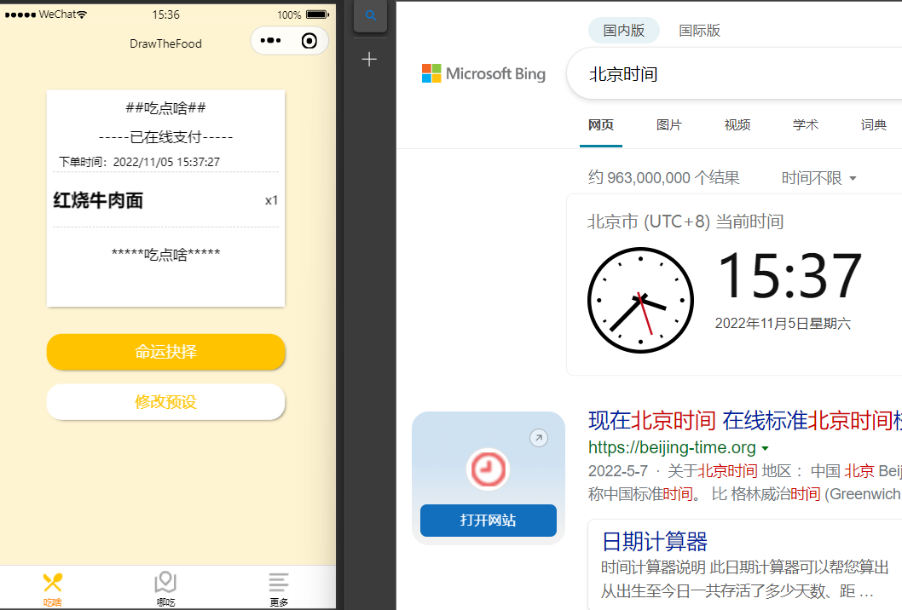

| 作业所属课程 | [软件工程](https://bbs.csdn.net/forums/gdut-ryuezh?typeId=33729) |
| :----------- | :----------------------------------------------------------- |
| 作业要求     | [团队作业4——项目冲刺](https://bbs.csdn.net/topics/608948198) |
| 作业目标     | 成员昨日工作完成情况及困难、每日感想<br />项目燃尽图、代码签入、项目截图 |

# 一、 站立式会议记录

## 1.1 开展形式

> 形式：每日固定时间在微信群聊上进行定点汇报。
>
> 记录：
>
> 
>
> 记录者：方琼

## 1.2 昨日进展

| 角色 | 进展                                                 |
| ---- | ---------------------------------------------------- |
| 开发 | 实现checkbox与globalData的关联、"吃啥"中订单实时功能 |
| 测试 | 检查具体实现情况                                     |

## 1.3 存在问题

暂无

## 1.4 今日计划

| 角色 | 人物     | 计划                             |
| ---- | -------- | -------------------------------- |
| 开发 | 吴彩华   | 完善复选框功能，设置全局数据通信 |
|      | 林仕龙   | "吃啥"中的菜单预设               |
| 测试 | 欧阳琳瑜 | 检查昨日问题改进                 |


# 二、项目燃尽图

> 链接：https://www.kdocs.cn/l/cbpnjTPRQajf

# 三、代码/文档签入记录

## 3.1 代码签入截图


# 四、项目程序/模块最新（运行截图）

## 4.1 代码展示

```js
//实现checkbox与globalData的关联  
globalData: {
    selectedAddress:[
      "一饭一楼",
      "一饭二楼",
      "二饭一楼",
      "二饭二楼",
      "三饭一楼",
      "三饭二楼",
      "四饭一楼",
      "四饭二楼"
    ]
  }

  onLoad (options){
    if(app.globalData.selectedAddress.length === this.data.addressArray.length){
      this.setData({allSelect:true})
    }
  },
      
//"吃啥"中订单实时功能
       onLoad: function (options) {
    var time=util.formatTime(new Date());
      this.setData({
        time:time
      })
    setInterval(()=>{
      var time=util.formatTime(new Date());
      this.setData({
        time:time
      })
    },1000)
  }
```


## 4.2 运行截图

### 4.2.1 实现checkbox与globalData的关联  



## 4.2.2 "吃啥"中订单实时功能



# 五、每日每人总结

| 人物     | 总结                                                   |
| -------- | ------------------------------------------------------ |
| 吴彩华   | 初步构建了checkbox与globalData的关联，一些功能还待完善 |
| 林仕龙   | 该功能的实现比较简单，主要是有修复轮播图的一些bug      |
| 欧阳琳瑜 | 开发好给力                                             |

