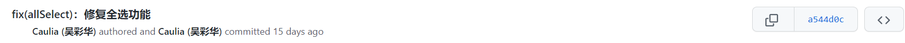

| 作业所属课程 | [软件工程](https://bbs.csdn.net/forums/gdut-ryuezh?typeId=33729) |
| :----------- | :----------------------------------------------------------- |
| 作业要求     | [团队作业4——项目冲刺](https://bbs.csdn.net/topics/608948198) |
| 作业目标     | 成员昨日工作完成情况及困难、每日感想<br />项目燃尽图、代码签入、项目截图 |

[toc]
# 一、 站立式会议记录

## 1.1 开展形式

> 形式：每日固定时间在微信群聊上进行定点汇报。
>
> 记录：
>
> 
>
> 记录者：方琼

## 1.2 昨日进展

| 角色 | 进展                                                 |
| ---- | ---------------------------------------------------- |
| 开发 | 完善复选框功能，设置全局数据通信、"吃啥"中的菜单预设 |
| 测试 | 检查昨日问题改进                                     |

## 1.3 存在问题

| 模块 | 问题                                             | 修改建议                                                     | 反馈                                             |
| ---- | ------------------------------------------------ | ------------------------------------------------------------ | ------------------------------------------------ |
| 主页 | 随机出结果后，上方时间不会停止                   | 出单后停下时间（1 截图覆盖式 2 跳转页面覆盖式），再次抉择时恢复正常时间 | 优化时再进行修改                                 |
| 主页 | 吃啥模块增加预设当次返回后无法保存，无法正常使用 | 增加返回自动保存数据                                         | 前端未及时合并分支，上传对应测试版本到微信小程序 |


## 1.4 今日计划

| 角色 | 人物     | 计划                          |
| ---- | -------- | ----------------------------- |
| 开发 | 吴彩华   | 修复全选功能、新增抽卡动画    |
|      | 林仕龙   | "吃啥"中的菜单新样式          |
| 测试 | 欧阳琳瑜 | 检查开发具体实现情况3：PC实测 |


# 二、项目燃尽图

> 链接：https://www.kdocs.cn/l/cbpnjTPRQajf

# 三、代码/文档签入记录

## 3.1 代码签入截图




# 四、项目程序/模块最新（运行截图）

## 4.1 代码展示

```js
  //完善复选框功能，设置全局数据通信
handleClick() {
      const status = this.data.checked
      let addressSelected = app.globalData.selectedAddress

      if(this.data.checked){
        addressSelected = addressSelected.filter(item => item !== this.data.value)
      } else {
        addressSelected.push(this.data.value)
      }
      this.setData({checked:!status})
      app.globalData.selectedAddress = addressSelected
      this.triggerEvent('observeall',{},{})
    },xxxxxxxxxx13 1    handleClick() {2      const status = this.data.checked3      let addressSelected = app.globalData.selectedAddress45      if(this.data.checked){6        addressSelected = addressSelected.filter(item => item !== this.data.value)7      } else {8        addressSelected.push(this.data.value)9      }10      this.setData({checked:!status})11      app.globalData.selectedAddress = addressSelected12      this.triggerEvent('observeall',{},{})13    },
        
//预设
        objectArray: [
      {
        id: 0,
        name: '无偏好',
        foodDetail:'粥 面包 馒头 全麦面包 馒头 粥类 杂粮 豆浆 脱脂牛奶 鸡蛋 苹果 蔬菜 油条 汉堡 蛋糕 饼干 薯条 火腿 方便面 北京烤鸭 泰餐 寿司 烧鸡 盖浇饭 砂锅 大排档 米线 满汉全席 西餐 麻辣烫 关东煮 自助餐 炒面 快餐 水果 西北风 馄饨 火锅 烧烤 泡面 速冻水饺'
      },
      {
        id: 1,
        name: '早餐',
        foodDetail:'粥 面包 馒头 全麦面包 馒头 粥类 杂粮 豆浆 脱脂牛奶 鸡蛋 苹果 蔬菜 油条 汉堡 蛋糕 饼干 薯条 火腿 方便面'
      },
      {
        id: 2,
        name: '午餐',
        foodDetail:'北京烤鸭 泰餐 寿司 烧鸡 盖浇饭 砂锅 大排档 米线 满汉全席 西餐 麻辣烫 关东煮 自助餐 炒面 快餐 水果 西北风 馄饨'
      },
      {
        id: 3,
        name: '下午茶',
        foodDetail:'喜茶 星巴克 C22 一点点 益禾堂 CoCo都可 茶理宜世 蜜雪冰城 奈雪の茶 古茗 书亦烧仙草 手挞柠檬茶 桃园三章'
      },
      {
        id: 4,
        name: '晚餐',
        foodDetail:'火锅 烧烤 泡面 速冻水饺 日本料理 涮羊肉 拉面 肯德基 面包 扬州炒饭 酸菜鱼 茶餐厅 海底捞 咖啡 比萨 麦当劳 兰州拉面 沙县小吃 烤鱼 海鲜 铁板烧 韩国料理 粥 快餐 东南亚菜 甜点 农家菜 川菜 粤菜 湘菜 竹笋烤肉'
      },
      {
        id: 5,
        name: '夜宵',
        foodDetail:'沙县小吃 烤鱼 海鲜 铁板烧 韩国料理 粥 快餐 东南亚菜 甜点 农家菜 川菜 粤菜 湘菜 竹笋烤肉'
      }
    ],
```


## 4.2 运行截图

预设新增后：


# 五、每日每人总结

| 人物     | 总结                                                   |
| -------- | ------------------------------------------------------ |
| 欧阳琳瑜 | 不了解这部分功能的代码用哪种实现方法，直接告诉开发修改 |
| 吴彩华   | 基本功能大致实现                                       |
| 林仕龙   | 增加预设菜单                                           |