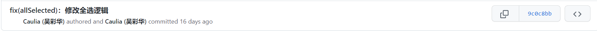
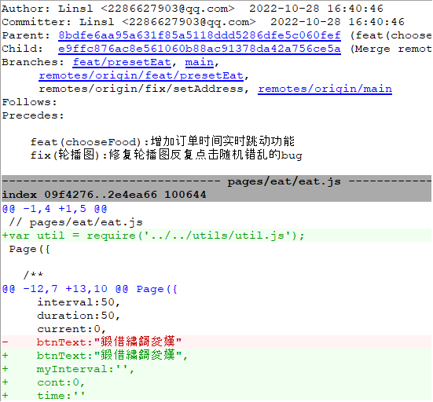
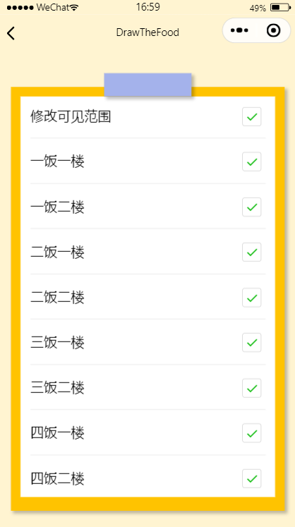

| 作业所属课程 | [软件工程](https://bbs.csdn.net/forums/gdut-ryuezh?typeId=33729) |
| :----------- | :----------------------------------------------------------- |
| 作业要求     | [团队作业4——项目冲刺](https://bbs.csdn.net/topics/608948198) |
| 作业目标     | 成员昨日工作完成情况及困难、每日感想<br />项目燃尽图、代码签入、项目截图 |

# 一、 站立式会议记录

## 1.1 开展形式

> 形式：每日固定时间在微信群聊上进行定点汇报。
>
> 记录：
>
> 
>
> 记录者：方琼

## 1.2 昨日进展

| 角色 | 进展                                       |
| ---- | ------------------------------------------ |
| 开发 | 修改预设全选逻辑、"吃啥"中命运抉择功能修复 |
| 测试 | 测试吃点啥模块、检查实现情况               |

## 1.3 存在问题

### 1.3.1 测试

| 问题                                               | 反馈                             | 备注 |
| -------------------------------------------------- | -------------------------------- | ---- |
| 选择逻辑：哪吃初始化只选中一个选项，初始化应该全选 | 反馈给开发，对初始化设置进行更改 |      |

### 1.3.2 开发

| 人物   | 所遇困难         | 问题描述                          |
| ------ | ---------------- | --------------------------------- |
| 吴彩华 | 修改预设全选逻辑 | 小程序checkbox组件提供的api不全面 |

## 1.4 今日计划

| 角色 | 人物     | 计划                           |
| ---- | -------- | ------------------------------ |
| 开发 | 吴彩华   | 实现checkbox与globalData的关联 |
|      | 林仕龙   | "吃啥"中订单实时功能           |
| 测试 | 欧阳琳瑜 | 检查具体实现情况               |


# 二、项目燃尽图

> 链接：

# 三、代码/文档签入记录

## 3.1 代码签入截图





# 四、项目程序/模块最新（运行截图）

## 4.1 代码展示

```js
 //修改预设全选逻辑
  setAllSelect:function(){
    // 若点击之前为true
    let preAddress = this.data.addressArray
    const status = this.data.allSelect

    if(this.data.allSelect){
      preAddress.map(item => {
        item.checked = false
        return item
      })
    } else {
      preAddress.map(item => {
        item.checked = true
        return item
      })
    }
    app.globalData.selectedAddress = status? []:this.returnSelectedArray(this.data.addressArray)
    this.setData({addressArray:preAddress,allSelect:!status})
  },

  observeAll(e) {
    // 监控是否全选
    if(app.globalData.selectedAddress.length === this.data.addressArray.length){
      this.setData({allSelect:true})
    } else {
      this.setData({allSelect:false})
    }
  },
      
      //bug修复已展示最终代码
```


## 4.2 运行截图

修改预设全选逻辑



# 五、每日每人总结

| 人物     | 总结                                                         |
| -------- | ------------------------------------------------------------ |
| 林仕龙   | 主要是有修复轮播图的一些bug                                  |
| 吴彩华   | 小程序的组件和文档提供的信息较少，需要自己构建组件           |
| 欧阳琳瑜 | 测试没有上传修改的代码，直接告诉开发修改，做了修改两次的无用功 |

