| 作业属于哪个课程 | [广工软件工程课程学习社区](https://bbs.csdn.net/forums/gdut-ryuezh) |
| :--------------- | :----------------------------------------------------------- |
| 作业要求         | [团队作业2-《需求规格说明书》-CSDN社区](https://bbs.csdn.net/topics/608634879) |
| 码云地址         | [DrawTheFood-teamwork · GitHub](https://github.com/DrawTheFood-teamwork) |
| 作业目标         | 1. 完成需求规格说明书； 2. 在团队计划中完成issues并完善之前的团队安排表； 3. 完善团队分工，每一位队员完成感想。 |

[toc]

#  第一章 需求规格说明书

## 一、引言

### 1.1 编写目的

> 此说明书用于介绍团队所开发的小程序，包括需求规格概述、具体页面和功能逻辑的实现、并对面向用户进行分析等方面，预期读者范围为团队所有成员。

### 1.2 产品概述

#### 1.2.1 产品名称

*DrawTheFood* (中文名称：画食)

#### 1.2.2 产品背景

> 这个项目的idea起源于一个几乎每个人在每一天都会考虑的问题：今天吃什么？
>
> 在校学生/打工人大多数倾向于在短时间内解决完需求，即去食堂或者点外卖——但在一段时间内的食堂不会一下子上新很多的档口，外卖不可能一下子多好多家，所以可供选择的食物在短时间内是不会有大变化的，于是选择区间变得有限，经过一段时间后，在有限的选择中也会不知道吃什么了。
>
> 本项目正是为了解决这个用户需求痛点诞生的——如果有一个小软件可以服务帮助于用户在饭点做一个决定，这样用户就可以不用纠结于吃什么的世纪难题了。

#### 1.2.3 产品目标

> *DrawTheFood* 小程序依靠微信开发平台进行开发，致力于解决在校大学生/打工族在饭点时吃什么、去哪吃的问题，并力求让小程序做到界面美观、体验舒适且交互友好，UI设计交互做到富有趣味性。

## 二、产品用户

### 2.1 用户画像说明

> 由于已确定了大致的用户人群为学生党或青年工作党，为节约时间成本，本次用户调研采用了用户访谈的方式，有目的地选取一部分典型**主要目标用户人群**进行用户访谈。

### 2.2 典型用户画像

#### 2.2.1 典型用户--小方

| 名字             | 小方                                                         |
| ---------------- | ------------------------------------------------------------ |
| 性别、年龄       | 女，20                                                       |
| 职业             | 在校大学生                                                   |
| 用户描述         | 月可支配收入在1500~2000之间，每周日均课程3节，每周点外卖次数超过5次，追求物美价廉和效率 |
| 动机、目的、困难 | 课程多导致吃饭时间被压缩，用点外卖的方式去解决中午或者晚上的吃饭问题，但外卖选择颇多，在选择外卖的过程中眼花缭乱。 |
| 用户偏好         | 在中午、晚上这两个时间段点外卖，且追求价格低                 |
| 典型场景         | 在课间5分钟点外卖，以保证下课可以及时拿到，但是在点外卖的时候出现了选择上的困难，于是点开小程序使用随机功能快速决定吃什么 |
| 典型描述         | 月可支配收入相对较低的学生党且需要快速解决在外卖平台做选择   |

用户需求：

> 1. 在5分钟内快速决定吃什么；
> 2. 希望外卖/菜品价格可以较为合理，不出现/少出现菜品价格过高的输出结果；
> 3. 对午餐、晚餐这两个时间段的需求较为集中。

需求分析：

> 1. 用户需要在5分钟内决定吃什么：
>    1. 点击小程序，首页即是随机选择菜品功能，减少用户交互时间；
>    2. 设置预设菜单，用户可以直接使用，减少增加菜单的时间。
>
> 2. 用户希望菜品价格合理，不出现或者较少出现菜品价格过高的结果：
>    1. 如果用户随机到不满意的选项（如遇到价格过高的外卖），还可以重新随机选择；
>    2. 增加用户自定义随机预设菜单的功能，用户可以在预设列表删掉价格过高的选项。
>
> 3. 对午餐、晚餐这两个时间段的需求较为集中：
>
>    用户可以对随机菜单列表进行预设设置，让列表变得适应午餐、晚餐的需求。

#### 2.2.2 典型用户--小罗

| 名字             | 小罗                                                         |
| ---------------- | ------------------------------------------------------------ |
| 性别、年龄       | 男，21                                                       |
| 职业             | 在校大学生，大二在读                                         |
| 用户描述         | 月可支配收入在1000~1500之间，每天去2-3次食堂，追求价廉，且所在学校校区面积大，有4个食堂可以选择，且4个食堂分布不同的宿舍区，较为分散，彼此之前有一段路需要走。 |
| 动机、目的、困难 | 知晓学校的食堂的菜式，对学校的食堂失去了大一刚入学的新鲜感，但由于生活费不够，限制了吃饭的消费地点在学校的四个食堂内。 |
| 用户偏好         | 饭点时间选择前往食堂（或者食堂的楼层），且倾向于选择离宿舍较近的食堂 |
| 典型场景         | 在校、且饭点时间选择哪个前往食堂就餐，点开小程序决定去哪个食堂 |
| 典型描述         | 月可支配收入相对较低的学生党且需要在多个食堂之中选择         |

用户需求：

> 1. 在饭点时间选择食堂，或者选择具体到食堂楼层；
> 2. 倾向于离宿舍较近的食堂。

需求分析：

> 1. 在饭点时间选择食堂，或者选择具体到食堂楼层：
>
>    小程序在随机功能中增加“去哪吃”的功能，且随机列表中已经存在食堂名称（具体到楼层）。
>
> 2. 倾向于离宿舍较近的食堂：
>
>    增加用户自定义随机食堂列表的功能，用户可以禁用一些食堂出现在随机列表中，但这种禁用是可逆的，用户可以设置它们重新出现。

#### 2.2.3 典型用户--Kim

| 名字             | Kim                                                          |
| ---------------- | ------------------------------------------------------------ |
| 性别、年龄       | 男，25                                                       |
| 职业             | 某公司的助理                                                 |
| 用户描述         | 月可支配收入在7000-9000之间，每周工作5-6天，白天工作午休时间在一个半小时左右，点外卖集中在11:30-1:00这个时间段，每周点外卖次数4-5次，Kim需负责部门每周1次的下午茶福利，每周有大概1次的加班需要。 |
| 动机、目的、困难 | 1. 午休时间短，于是午饭最多的选择变为了外卖，不知道吃什么； 2. 需要负责每周一次的下午茶福利，需要在不耽误其他工作的情况下完成下单下午茶； 3. 有加班需要，加班后可能会点夜宵。 |
| 用户偏好         | 对外卖的价格没有太多的要求，但追求点外卖的效率和送达的时间快速，工作日需要在吃完午饭小憩一下，有轻微选择恐惧症 |
| 典型场景         | 1. 临近午休的时间，在预留出午休时间情况下点一份快速送达的外卖； 2. 工作时间决定每一周下午茶福利的发放内容； 3. 在加班疲惫的情况，在通勤回家的路上点一份外卖慰藉人心。 |
| 典型描述         | 工作党需要找到工作和自身需求的平衡。                         |

用户需求：

> 1. 午休时间短，选择点外卖但不知道吃什么，对外卖没有价格上的要求，更希望外卖送达时间快；
> 2. 完成每周一次的下午茶福利发放的工作任务；
> 3. 加班后会想点一份外卖回家。

需求分析：

> 1. 午休时间短，选择点外卖但不知道吃什么，对外卖没有价格上的要求，更希望外卖送达时间快：
>
>    用户可以自定义预设菜单列表，可以添加一些离公司近的外卖选择。
>
> 2. 完成每周一次的下午茶福利发放的工作任务&加班后会想点一份外卖回家：
>
>    添加“下午茶”&“夜宵”的预设菜单，用户可以更改至下午茶或夜宵列表进行随机选择。

## 三、项目描述

### 3.1 产品范围

#### 3.1.1 工作切分

| 业务事件名称         | 输入                   | 输出                   |
| -------------------- | ---------------------- | ---------------------- |
| 随机获取菜名（主页） | 键入随机选择按钮       | 依照预设，随机生成结果 |
| 菜单列表预设修改     | 新增/修改/删除菜品字段 | 新的菜单列表           |
| 菜单偏好设置         | 选择一个预设列表       | 更改主页预设菜单       |
| 随机获取食堂名       | 键入随机选择按钮       | 依照预设，随机生成结果 |
| 参数设置             | 选择食堂可见范围       | 生成食堂预设列表       |

#### 3.1.2 产品边界

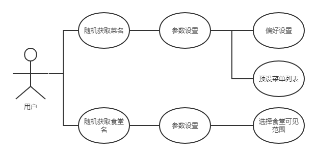

### 3.2 功能需求

#### 3.2.1 总述

> 系统包含两大模块：吃什么（作为主页）和在哪吃，并且为未来后续开发留下了足够的版面。吃什么主要完成随机获取菜名的功能，在哪吃主要完成随机获取食堂名的功能。

| 原型图链接 | https://modao.cc/app/YPiOcBArjjpoiamdrUycN #DrawTheFood-分享 |
| ---------- | ------------------------------------------------------------ |

#### 3.2.2 功能需求--主页

| 功能名称   | 主页                                                         |
| ---------- | ------------------------------------------------------------ |
| 描述       | 小程序主页，【吃什么】功能模块                               |
| 功能介绍   | 主页为随机选择菜名的功能，点击“随机选择”的按钮进行选择，结果将会展示在【？？？】这个区域，如果不满意，可以进行重选，可点击下方的按钮进行自定义设置，底部导航栏图标点击可以前往其余的功能区。 |
| 流程图     | 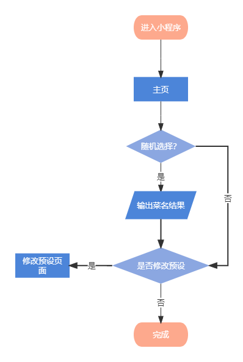 |
| 数据项描述 | 主要展示字段：以菜名为代表的字符串 数据来源：预设的菜单列表 |
| 原型图     | 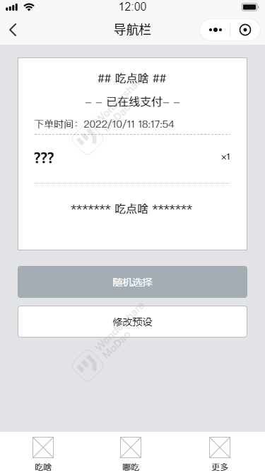 |

#### 3.2.2 功能需求--主页-自定义设置

| 功能名称   | 修改预设                                                     |
| ---------- | ------------------------------------------------------------ |
| 描述       | 对小程序【吃什么】这部分功能模块的自定义设置                 |
| 功能介绍   | 修改预设这里具体分为两个小模块，： 1.【偏好设置】，偏好设置中有五个选项：早餐、午餐、下午茶、晚餐、夜宵，点击不同的选项会出现不同的预设菜单； 2. 【预设菜单】，用户可对预设菜单中的字段进行增加、修改、删除等操作，修改等操作，新增/修改需要用户每新增/更改一个，就加空格键断开字段做区分。 |
| 流程图     | 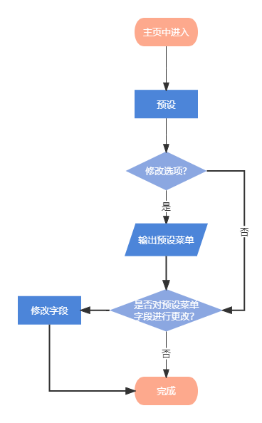      |
| 数据项描述 | 主要展示字段：预设菜单选项、以菜名为代表的字符串 数据来源：预设的菜单列表 |
| 原型图     | 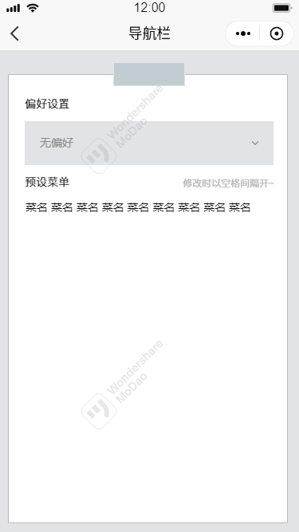 |

#### 3.2.3 功能需求--去哪吃

| 功能名称   | 去哪吃                                                       |
| ---------- | ------------------------------------------------------------ |
| 描述       | 小程序【去哪吃】模块                                         |
| 功能介绍   | 这部分包括随机选择食堂的功能，点击“随机选择”进行选择并输出结果，如果不满意，可以进行重选，点击“修改预设”跳转到修改预设的界面。 |
| 流程图     | 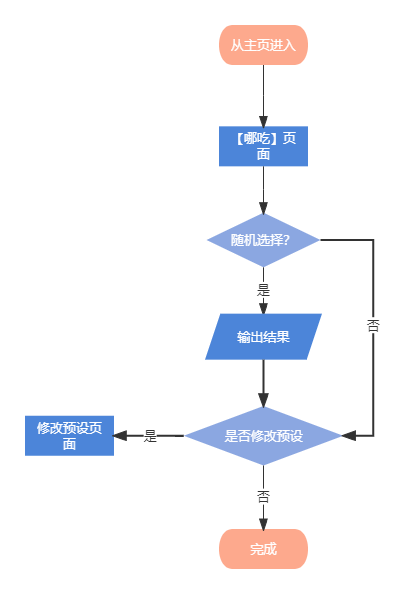 |
| 数据项描述 | 主要展示字段：字符串 数据来源：预设的食堂列表           |
| 原型图     | 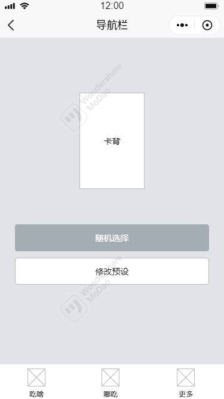 |

#### 3.2.4 功能需求--去哪吃-修改预设

| 功能名称   | 修改预设                                                     |
| ---------- | ------------------------------------------------------------ |
| 描述       | 针对【哪吃】页面功能的修改预设                               |
| 功能介绍   | 修改预设这里仅对可见范围进行修改，可以选择全选或全不选，或者选择所需要的内容。 |
| 流程图     | 略                                                           |
| 数据项描述 | 数据来源：预设的菜单列表                                     |
| 原型图     | 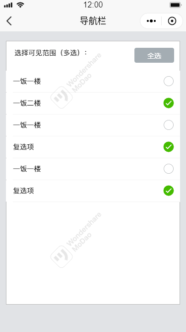 |

# 第二章 团队计划

## 一、issues截图

### 1.1 方琼

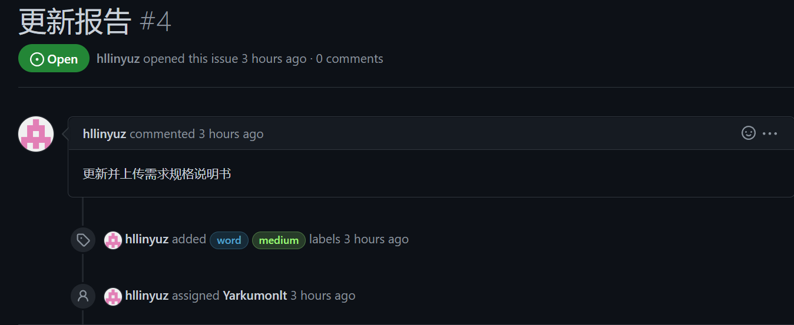

### 1.2 欧阳琳瑜

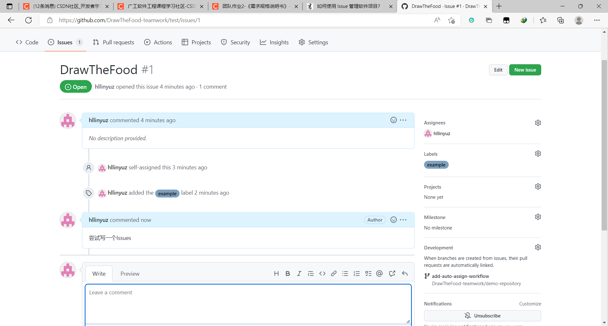

### 1.3 吴彩华

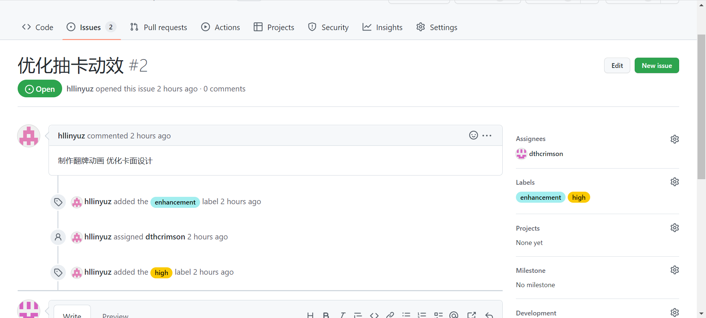

### 1.4 林仕龙

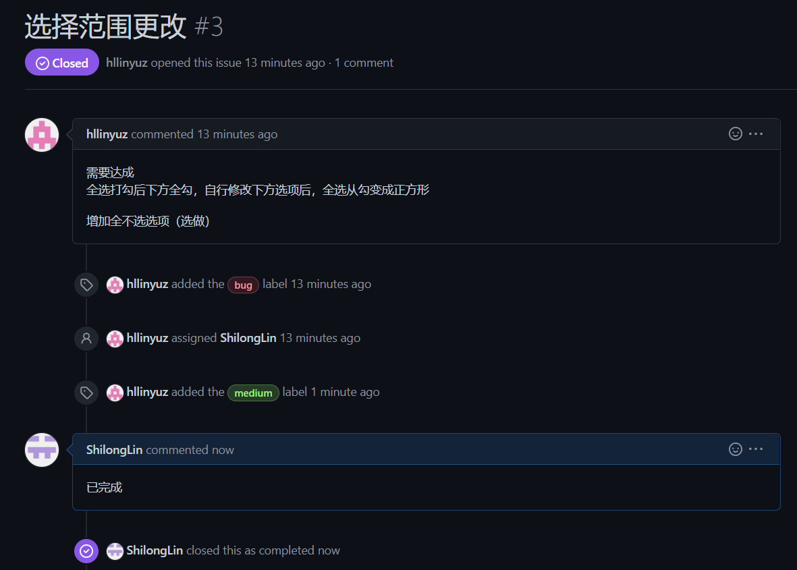

## 二、 团队安排表

### 2.1 原有安排

| 时间截点 | 完成任务                                                     | 阶段成果展示形式  | 备注                                    |
| :------- | :----------------------------------------------------------- | :---------------- | :-------------------------------------- |
| -10.16   | 1. 团队组队、团队博客                                        | 团队随笔          |                                         |
|          | 2.团队介绍、成员展示、角色分配、选题确定                     |                   |                                         |
|          | 3.制定团队计划安排，团队贡献分的规定                         |                   |                                         |
| -10.19   | 原型设计、项目需求说明书                                     | 需求初审          | 时间紧迫，用户访谈采样量可以减少        |
| -10.24   | 编码规范完成、平台环境搭建完成、接口格式确定、需求规格书终版、初步架构搭建，原型改进 | 编码框架+需求复审 |                                         |
| -10.26   | UI设计、架构设计、测试计划                                   | 设计评审          |                                         |
| -11.2    | 7天的Alpha敏捷冲刺，7 篇 每日Scrum Meeting博客+代码提交，编码+测试+代码提交 | Alpha版本发布     | 基本的功能先实现，小bug在优化的时候修改 |
| -11.9    | 项目优化，用户反馈，测试计划改进                             | 改进总结调整      |                                         |
| -11.11   | 正式版本完善+用户手册，部署上线                              | 演示报告          | 着手第二版本版本拓展开发                |

### 2.2 校正后的安排

| 时间截点 | 完成任务                                                     | 阶段成果展示形式  | 备注                                    |
| :------- | :----------------------------------------------------------- | :---------------- | :-------------------------------------- |
| -10.16   | 1. 团队组队、团队博客                                        | 团队随笔          | 已完成                                  |
|          | 2.团队介绍、成员展示、角色分配、选题确定                     |                   | 已完成                                  |
|          | 3.制定团队计划安排，团队贡献分的规定                         |                   | 已完成                                  |
| -10.22   | 原型设计、项目需求说明书、**issues安排**                     | 需求初审          | 根据安排更改且项目需求书比想象中的难写  |
| -10.24   | 编码规范、平台环境搭建、确定接口格式、需求规格书终版、初步架构搭建，原型改进 | 编码框架+需求复审 |                                         |
| -10.26   | UI设计、架构设计、测试计划                                   | 设计评审          |                                         |
| -11.2    | 7天的Alpha敏捷冲刺，7 篇 每日Scrum Meeting博客+代码提交，编码+测试+代码提交 | Alpha版本发布     | 基本的功能先实现，小bug在优化的时候修改 |
| -11.9    | 项目优化，用户反馈，测试计划改进                             | 改进总结调整      |                                         |
| -11.11   | 正式版本完善+用户手册，部署上线                              | 演示报告          |                                         |

### 2.3 校正计算方法

> 根据目前进度和开发速度来进行校正，但变动不大，因为开发进度基本和原先安排一样。

# 附录

## 一、团队分工

| 工作         | 负责人         |
| ------------ | -------------- |
| 产品设计、UI | 方琼           |
| 开发         | 吴彩华、林仕龙 |
| 测试         | 欧阳琳瑜       |

## 二、目前进度

> 截止报告完成（10月22日），已完成需求初审和需求复审、代码框架已经搭建完成，UI设计也已经初步完成，比预期安排提前2天。
>

## 三、每个人的感想

| 人员     | 感想                                                         |
| -------- | ------------------------------------------------------------ |
| 方琼     | 本次项目我主要负责产品设计和UI设计两个方面，在完成作业的过程中我学会了具体需求规格书的书写和项目管理方面的一些小技巧，受益匪浅，也非常感谢我的队员对我作为队长这一职务的支持~ |
| 吴彩华   | 我在此次团队合作编程作业中担任开发角色。从小组的建立到如今项目初见雏形的过程中，我感受到了小组成员的热情。每一个人都积极地回应项目过程中的问题，这样的小组氛围让我充满了动力。此次写小程序是我之前接触不多的，基于vue的小程序框架冲击了我长久以来使用react构成的编程思维。在学习和开发过程中，我受益良多。 |
| 林仕龙   | 在这次我负责的工作中，我的工作担当是界面构建，因为之前还未接触过小程序的开发，所以在构建过程中都是边学边用的。在构建界面的开发过程中，出线过大大小小的一些问题，比如git提交的格式不规范，开发使用的一些方法是较老的版本等等，通过和成员彩华交谈后一一解决。目前开发没有难结点，比较顺利，希望我们能再接再厉，一帆风顺。 |
| 欧阳琳瑜 | 这周主要是队长负责写规格要求说明书，我则是按照一开始的分工，去学习一些我需要用到新知识，补充自己的能力。结合团队选择使用的开发平台，我去看了微信小程序的相关知识，去b站找视频学习了一下在小程序怎么写测试，目前进度还在学习中，没看完全部视频。 |